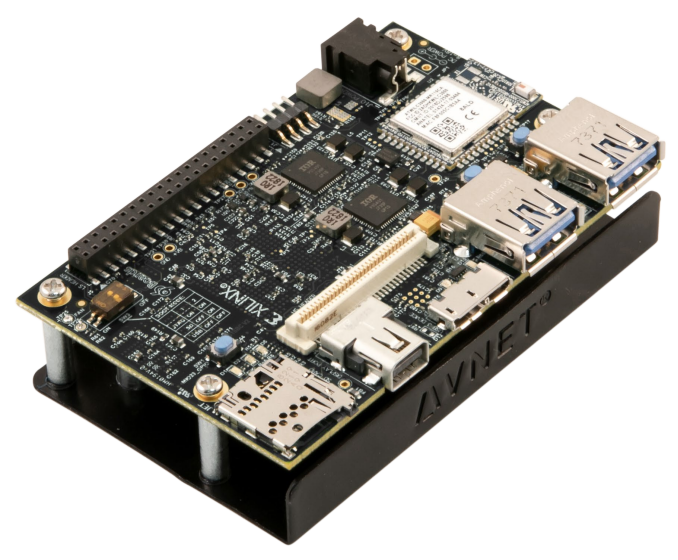

# Ultra96v2-sandbox

Sandbox for Avnet's Ultra96v2 MPSoC Eval board

## Install Vivado Board Definition Files

Follow [the process from ultra96.org](http://www.ultra96.org/sites/default/files/documentations/Installing-Board-Definition-Files_v1_0_0.pdf) which involves cloning the [Avnet bdf repo](https://github.com/Avnet/bdf) and copying the files to `<vivado_install_location>/Vivado/<version>/data/boards/board_files/`

### Project Source Control

In Vivado TCL console:
* To create project from TCL, `> source <create_prj>.tcl`
* To save project changes to TCL, `> write_project_tcl <create_prj>.tcl`

For more info, see [Xilinx AR 56421](https://support.xilinx.com/s/article/56421?language=en_US)

## References

* [Avnet Community Page & Resources for Ultra96v2](https://www.element14.com/community/community/designcenter/zedboardcommunity/ultra96/overview)
